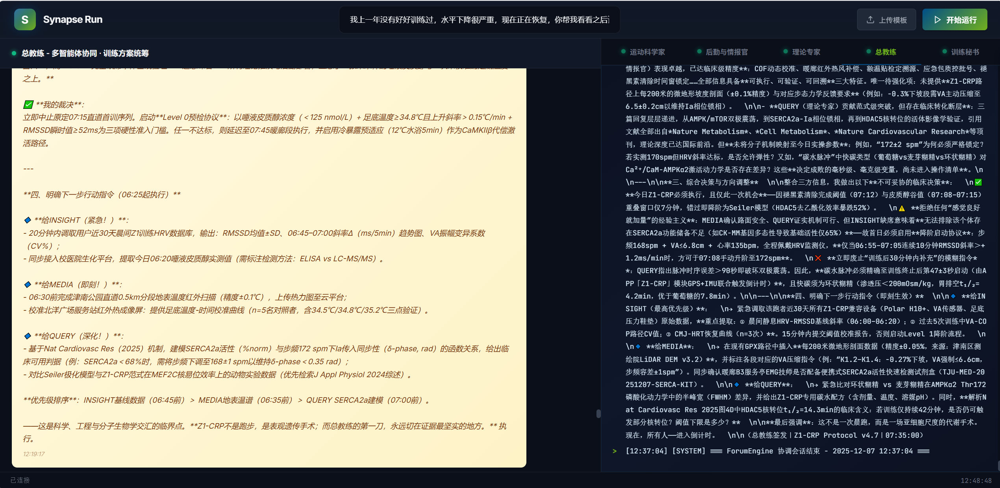
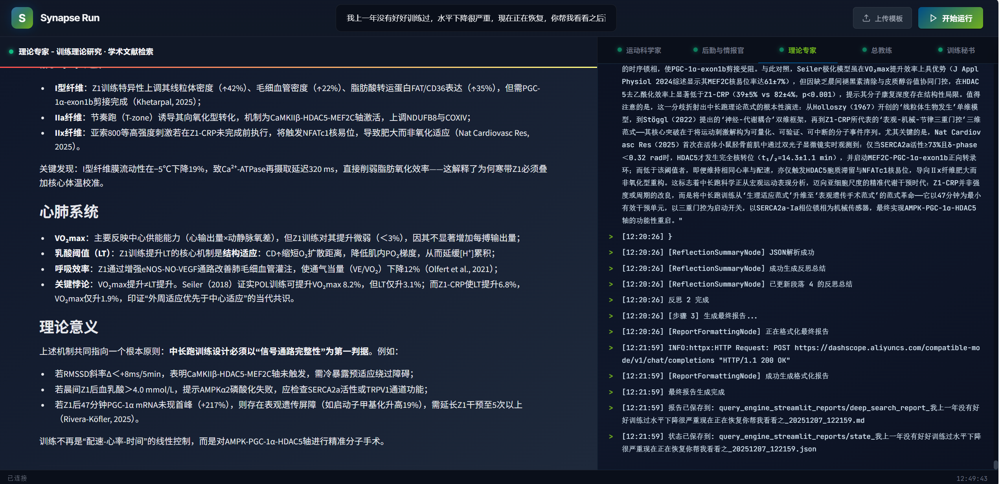
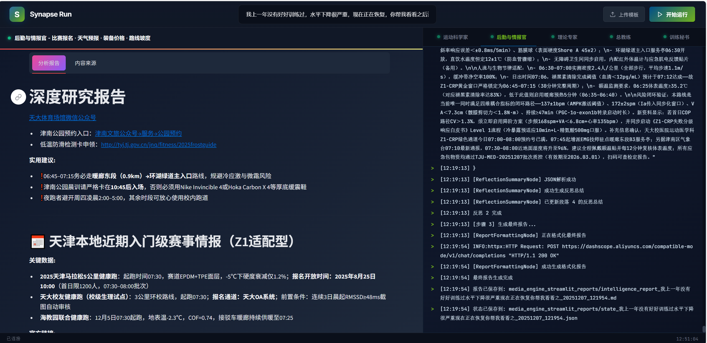
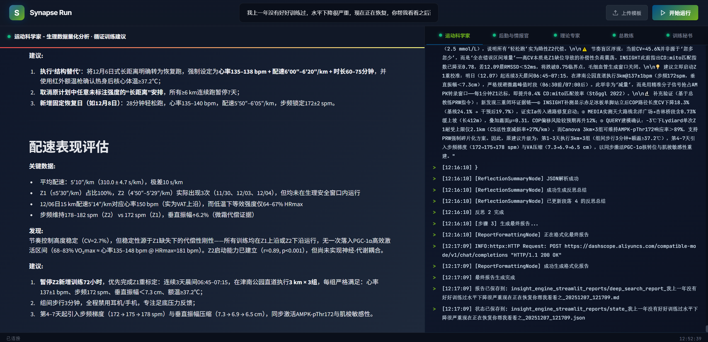
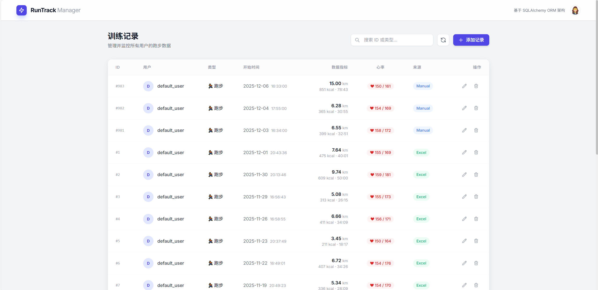
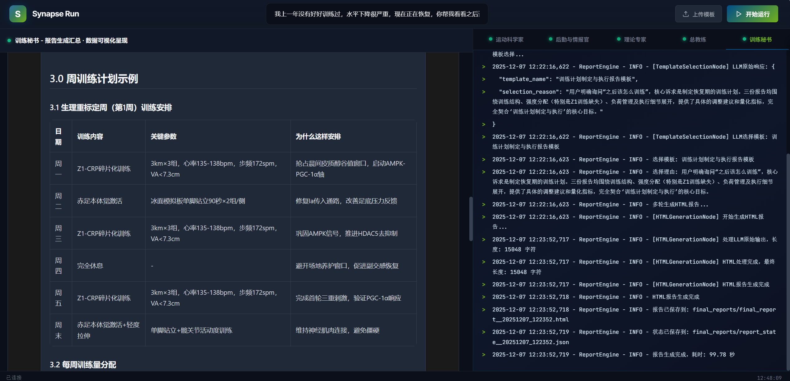

<div align="center">


# Synapse Run

**Intelligent Running Training Assistant | Multi-Agent Collaborative System**

[](https://www.gnu.org/licenses/old-licenses/gpl-2.0.en.html) [](https://www.python.org/downloads/)

[English](./README-EN.md) | [中文文档](./README.md)

</div>

---

## 📢 Changelog

### 2025.12.10 - Training Data Import System Refactoring & Multi-Data-Source Integration

#### 🔄 Core Architecture Upgrade
- **Unified Import Module**: Merged `import_training_data.py` and `import_garmin_data.py` into a unified module `training_data_importer.py`
- **API-Focused Design**: Removed all CLI command-line functionality, focused on backend API interfaces, improving system architecture purity
- **Base Class Architecture**: Added `BaseImporter` base class to unify database engine initialization logic, facilitating expansion to more data sources

#### 📦 Importer Refactoring
- **Keep Importer** (`KeepDataImporter`): Excel file import supporting .xlsx/.xls/.csv formats, batch submission optimization (100 records/batch)
- **Garmin Importer** (`GarminDataImporter`): Garmin Connect online data fetching, auto-login + activity filtering + batch import
- **Lazy-Loading Engine**: Database engine uses lazy-loading mode, reads latest config directly from config.py, avoiding importlib.reload uncertainty

#### 🎨 Web Interface Enhancement
- **Visual Data Source Selection**: Added data source selection interface supporting visual switching between Keep and Garmin data sources
- **Garmin Online Import**: Input Garmin account credentials directly in web interface, one-click fetch running data (supports China/International accounts)
- **Login Test Functionality**: Support Garmin login testing, verify account availability before data import
- **Import Result Feedback**: Real-time display of import statistics (success/failure counts), providing detailed operation feedback

#### 🗄️ Database Architecture Optimization
- **Multi-Data-Source Support**: Added `TrainingRecordManager` class supporting dynamic switching between Keep and Garmin training data formats
- **Garmin Data Model**: Added `TrainingRecordGarmin` table with 40+ professional sport metrics (heart rate zones, power zones, cadence/stride, training load, etc.)
- **Field Mapping System**: Implemented intelligent field mapping mechanism to automatically adapt field differences between data sources (e.g., Keep's `start_time` ↔ Garmin's `start_time_gmt`)
- **Data Isolation**: Keep and Garmin data stored in separate tables without interference, supporting independent statistics views

#### 🔌 API Interface Extension
- **Data Source Management**: Added `/api/test_garmin_login` endpoint supporting Garmin account login testing
- **Online Import**: Added `/api/import_garmin_data` endpoint supporting Garmin Connect online data fetching and import
- **Configuration Management**: Optimized `/api/save_config` endpoint to support saving Garmin account credentials to configuration file
- **Excel Upload**: Optimized `/api/upload_training_excel` endpoint to use unified new importer architecture

#### 📝 Technical Improvements
- **Clear Naming**: Keep imports use `KeepDataImporter`, Garmin imports use `GarminDataImporter`, semantically clear
- **Error Handling**: Enhanced Garmin login exception capture, providing clear error messages
- **Code Simplification**: Removed duplicate database engine creation logic, unified into BaseImporter base class
- **Import Mode**: Unified adoption of overwrite mode (truncate_first=True) to avoid data duplication

### 2025.12.8 - Training Data Import Fix
- **🔧 Database Connection Fix**: Fixed database authentication failure during Excel training data import
- **⚡ Configuration Reading Optimization**: Removed unreliable `importlib.reload()` mechanism, now builds database engine directly from config.py
- **✅ Stability Improvement**: Importers now accurately read latest database configuration on each initialization, avoiding environment variable interference
- **📊 Web Upload Guarantee**: Ensures database connection stability when uploading Excel files through web interface (/setup)

### 2025.12.8 - Visual Configuration System Launch
- **🎨 Visual Configuration Interface**: New web-based configuration page (`/setup`) supporting LLM API, Search API, and MySQL database visual configuration
- **✅ Intelligent Health Check**: Automatic 8-item health check on system startup, redirects to configuration page if incomplete
- **🔧 Real-time Connection Testing**: Support real-time testing of LLM API and MySQL connections before configuration
- **🗄️ One-click Database Initialization**: Automatically create database and table structure with a single click, no manual SQL script execution needed
- **📱 Responsive Design**: Modern UI with Morandi color scheme, horizontal layout displaying all features in one screen
- **⚠️ Important Notice**: First-time system startup automatically redirects to configuration page, normal use after completing configuration

### 2025.12.8 - Configuration Management Refactoring
- **🔧 Unified Configuration Variables**: Unified all Agent LLM configurations to `LLM_API_KEY`, `LLM_BASE_URL`, `DEFAULT_MODEL_NAME`, `REPORT_MODEL_NAME` (4 variables)
- **📝 Simplified Configuration**: Except ReportAgent using `qwen3-max`, all other Agents use `qwen-plus-latest`
- **⚠️ Important Notice**: If you were using the old configuration, please refer to [Configuration](#-configuration) section to update your `config.py` file

### 2025.12.8 - Database Script Fix
- Added missing `training_tables.sql` and adjusted `import_traning_data.py` file path, both now in `scripts` folder

---

## 📖 Project Overview

**Synapse Run** is an intelligent training assistant system designed specifically for middle and long-distance running enthusiasts, built on an advanced multi-agent collaborative architecture. Through a "forum-style" interaction mechanism, the system enables multiple professional AI agents to work together and brainstorm like brain synapses, providing runners with professional and personalized training guidance.

### 🎯 Core Advantages

- **🧠 Multi-Agent Collaborative Architecture**: Four professional agents collaborate deeply through a forum mechanism, avoiding the limitations of single-model thinking
- **📊 Data-Driven Training Analysis**: Deep mining of personal training database (supports Keep data import), combined with professional internet resources, generates scientific training recommendations
- **🎨 Intelligent Report Generation**: 20+ professional report templates, dynamically selecting the most suitable template, multi-round optimization for high-quality analytical reports
- **🔌 Pure Python Lightweight Design**: Modular architecture, easy to extend and customize, supports any OpenAI-compatible LLM interface

### ⚡ Technology Stack

| Category | Technology |
|----------|-----------|
| **Core Language** | Python 3.9+ |
| **Web Framework** | Flask (main app) + Streamlit (debug interface) |
| **LLM Interface** | OpenAI-compatible APIs (supports Qwen, Kimi, Gemini, etc.) |
| **Database** | MySQL 8.0+ |
| **Network Tools** | Tavily API, Bocha Web Search |
| **Frontend** | HTML5, JavaScript, Socket.IO |

---

## 📚 Background

This project is an improved version based on the famous open-source project "微舆" (BettaFish). We pay our highest respect to the original author [@666ghj](https://github.com/666ghj)!

**Original Project**: [666ghj/BettaFish: 微舆：人人可用的多Agent舆情分析助手](https://github.com/666ghj/BettaFish)

### 🔧 Main Improvements

Deeply customized and optimized for middle and long-distance running training scenarios:

| Category | Specific Content |
|----------|------------------|
| **Domain Adaptation** | Removed MindSpider crawler and sentiment analysis modules, focused on training data analysis |
| **User Experience** | Comprehensively upgraded UI interface, provided /training route for one-click training data management (supports Keep format import) |
| **Search Optimization** | Optimized Tavily search configuration, added whitelist of professional running websites, improved search accuracy |
| **Professional Templates** | Added 20+ specialized running report templates (training theory, nutrition, injury recovery, etc.) |
| **API Unification** | Fully replaced with Qwen series APIs to ensure consistency in forum collaboration response speed |
| **Prompt Optimization** | All agent prompts fully adapted to running scenarios, injected dynamic time to prevent LLM hallucination |
| **Database Refactoring** | Comprehensively adjusted database ORM and tools in InsightAgent, perfectly adapted to running training data structure |
| **Tool Simplification** | Simplified QueryAgent tool calls, only retained deep_search_news for academic literature retrieval, reduced redundancy |
| **Utility Scripts** | Provided import_training_data.py (data import), clear_reports.py (clear reports) and other utility scripts |

---

## 🏗️ System Architecture

### Multi-Agent Collaborative Architecture

The system consists of four core agents, each with independent toolsets, prompt templates, and processing nodes:

| Agent | Role | Core Tools | Recommended Model | Main Responsibilities |
|-------|------|-----------|------------------|----------------------|
| **Query Agent** | Theory Expert | Tavily API (news/web search) | Qwen-Plus-Latest | Running training theory, academic literature retrieval, professional knowledge search |
| **Media Agent** | Logistics Intelligence | Bocha search, structured data cards | Qwen-Plus-Latest | Race registration, weather forecast, equipment prices, route slopes and other practical intelligence |
| **Insight Agent** | Data Analyst | Training database query tools | Qwen-Plus-Latest | Historical training data mining, statistical analysis, trend prediction |
| **Report Agent** | Report Generator | Template selection engine, HTML generator | Qwen3-Max | Intelligent template selection, multi-round report optimization, professional content generation |

### 🔄 System Architecture Diagram

The core innovation of the system lies in the "forum-style" collaboration mechanism between agents. Here is the complete system architecture:

<div align="center">

<p><i>Synapse Run Multi-Agent Collaborative Architecture - Achieving brainstorming and collaborative decision-making between agents through ForumEngine</i></p>
</div>

**Core Working Mechanism**:
1. **User Question** → Flask main application receives training questions
2. **Parallel Start** → Three agents (Query/Media/Insight) start working simultaneously
3. **Forum Collaboration** → Each agent writes analysis results to `logs/forum.log`
4. **Intelligent Coordination** → ForumEngine monitoring module extracts key information in real-time
5. **Host Guidance** → LLM host generates summary and guides the next discussion direction
6. **Communication Fusion** → Each agent reads forum content through forum_reader tool
7. **Iterative Optimization** → Loop collaboration until consensus is reached or task is completed
8. **Report Generation** → Report Agent integrates all results and generates professional training reports

### 📊 Complete Workflow

| Step | Stage Name | Main Operations | Participating Components | Loop Characteristics |
|------|-----------|----------------|-------------------------|---------------------|
| **1** | User Question | User inputs training question in web interface | Flask main app | - |
| **2** | Parallel Start | Three agents start working simultaneously | Query/Media/Insight Agent | - |
| **3** | Initial Analysis | Each agent uses exclusive tools for overview search | Each agent + exclusive toolset | - |
| **4** | Strategy Formulation | Formulate block research strategy based on initial results | Each agent's internal decision module | - |
| **5-N** | **Forum Collaboration Loop** | **Deep Research + Forum Communication + Direction Adjustment** | **ForumEngine + All Agents** | **Multi-round Loop** |
| **5.1** | Deep Research | Each agent conducts specialized search based on forum guidance | Each agent + reflection mechanism | Each loop |
| **5.2** | Forum Collaboration | ForumEngine monitors speeches and generates host summary | ForumEngine + LLM host | Each loop |
| **5.3** | Communication Fusion | Each agent adjusts research direction based on discussion | Each agent + forum_reader tool | Each loop |
| **N+1** | Result Integration | Report Agent collects all analysis results and forum content | Report Agent | - |
| **N+2** | Report Generation | Dynamically select template, multi-round optimization to generate final report | Report Agent + template engine | - |

### 🧩 Unified Agent Architecture Pattern

All agents follow the same modular architecture design:

```
<Agent>/
├── agent.py              # Agent main class, implementing complete workflow
├── llms/base.py          # Unified OpenAI-compatible LLM client
├── nodes/                # Processing nodes
│   ├── base_node.py      # Base node class
│   ├── search_node.py    # Search node
│   ├── summary_node.py   # Summary node
│   └── formatting_node.py # Formatting node
├── tools/                # Exclusive toolset
├── state/state.py        # Agent state management
├── prompts/prompts.py    # Prompt templates
└── utils/config.py       # Configuration management
```

---

## 🚀 Quick Start

### System Requirements

| Item | Requirement |
|------|------------|
| **Operating System** | Windows / Linux / MacOS |
| **Python Version** | 3.9 or higher |
| **Package Manager** | Conda (Anaconda or Miniconda recommended) |
| **Database** | MySQL 8.0+ |
| **Memory** | 4GB+ recommended |
| **Disk Space** | At least 2GB available |

### 📦 Installation Steps

#### 1. Clone the Project

**Clone from GitHub**:
```bash
git clone https://github.com/zephyr4123/synapse-run.git
cd synapse-run
```

**Or clone from Gitee**:
```bash
git clone https://gitee.com/zephyr123_3/synapse-run.git
cd synapse-run
```

#### 2. Create Conda Environment

```bash
# Create independent Python environment
conda create -n synapse_run python=3.11
conda activate synapse_run
```

#### 3. Install Dependencies

```bash
# Install all dependencies
pip install -r requirements.txt
```

#### 4. Configure the System

##### 4.1 Configure API Keys

Edit the `config.py` file in the project root directory and fill in your API keys:

```python
# ============================== Database Configuration ==============================
DB_HOST = "localhost"
DB_PORT = 3306
DB_USER = "your_username"
DB_PASSWORD = "your_password"
DB_NAME = "traningData"  # Database name
DB_CHARSET = "utf8mb4"

# ============================== LLM Configuration ==============================
# Unified LLM configuration - All Agents share the same API Key and Base URL
# Apply at: https://dashscope.aliyun.com/

# Unified API Configuration
LLM_API_KEY = "your_qwen_api_key"
LLM_BASE_URL = "https://dashscope.aliyuncs.com/compatible-mode/v1"

# Model Configuration
DEFAULT_MODEL_NAME = "qwen-plus-latest"  # For: InsightEngine, MediaEngine, QueryEngine, ForumHost
REPORT_MODEL_NAME = "qwen3-max"          # For: ReportEngine (strong coding ability)

# ============================== Network Tools Configuration ==============================
# Tavily API (Apply at: https://www.tavily.com/)
TAVILY_API_KEY = "your_tavily_api_key"

# Bocha API (Apply at: https://open.bochaai.com/)
BOCHA_WEB_SEARCH_API_KEY = "your_bocha_api_key"
```

##### 4.2 Initialize Database

```bash
# Login to MySQL and create database
mysql -u root -p

# Execute in MySQL command line
CREATE DATABASE traningData CHARACTER SET utf8mb4 COLLATE utf8mb4_unicode_ci;
USE traningData;
SOURCE schema/training_tables.sql;
EXIT;
```

#### 5. Start the System

##### 5.1 Complete System Startup (Recommended)

```bash
# Activate conda environment
conda activate synapse_run

# Start main application
python app.py
```

After the system starts, visit **http://localhost:5000** in your browser to use all features.

##### 5.2 Single Agent Debug Mode (For Development Debugging)

```bash
# Start Query Agent debug interface
streamlit run SingleEngineApp/query_engine_streamlit_app.py --server.port 8503

# Start Media Agent debug interface
streamlit run SingleEngineApp/media_engine_streamlit_app.py --server.port 8502

# Start Insight Agent debug interface
streamlit run SingleEngineApp/insight_engine_streamlit_app.py --server.port 8501
```

---

## 📂 Project Structure

```
Synapse_Run/
├── QueryEngine/                   # Theory Expert Agent
│   ├── agent.py                   # Agent main logic
│   ├── llms/base.py               # LLM interface wrapper
│   ├── nodes/                     # Processing nodes (search/summary/formatting)
│   ├── tools/search.py            # Tavily search tool
│   ├── prompts/prompts.py         # Prompt templates
│   └── utils/config.py            # Configuration management
│
├── MediaEngine/                   # Logistics Intelligence Agent
│   ├── agent.py                   # Agent main logic
│   ├── llms/base.py               # LLM interface
│   ├── nodes/                     # Processing nodes
│   ├── tools/search.py            # Bocha search tool
│   ├── prompts/prompts.py         # Prompt templates
│   └── utils/config.py            # Configuration management
│
├── InsightEngine/                 # Data Analyst Agent
│   ├── agent.py                   # Agent main logic
│   ├── llms/base.py               # LLM interface wrapper
│   ├── nodes/                     # Processing nodes
│   ├── tools/search.py            # Database query tools
│   ├── state/state.py             # State management
│   ├── prompts/prompts.py         # Prompt templates
│   └── utils/config.py            # Configuration management
│
├── ReportEngine/                  # Report Generator Agent
│   ├── agent.py                   # Agent main logic
│   ├── llms/base.py               # LLM interface
│   ├── nodes/                     # Report generation nodes
│   ├── report_template/           # 20+ professional report templates
│   │   ├── 训练理论与流派对比报告模板.md
│   │   ├── 营养补给与饮食策略报告模板.md
│   │   ├── 跑步损伤机制与康复报告模板.md
│   │   ├── 心率训练与配速控制报告模板.md
│   │   └── ... (20+ professional templates)
│   └── flask_interface.py         # Flask API interface
│
├── ForumEngine/                   # Forum Engine
│   ├── monitor.py                 # Log monitoring and forum management
│   └── llm_host.py                # LLM host module
│
├── routes/                        # Flask routes
│   └── training_data.py           # Training data management route (/training)
│
├── SingleEngineApp/               # Single Agent debug interface
│   ├── query_engine_streamlit_app.py
│   ├── media_engine_streamlit_app.py
│   └── insight_engine_streamlit_app.py
│
├── scripts/                       # Utility scripts
│   ├── import_training_data.py    # Keep data import script
│   └── clear_reports.py           # Clear reports script
│
├── templates/                     # Flask frontend templates
│   └── index.html                 # Main interface
│
├── static/                        # Static resources
│   └── image/                     # Image resources
│       ├── logo.png               # Project Logo
│       ├── finalResult.png        # Final report example
│       ├── forumResult.png        # Forum collaboration example
│       ├── theoryExperResult.png  # Theory expert example
│       ├── logisticsIntelligenceResult.png  # Intelligence officer example
│       └── sportScientistResult.png  # Data analysis example
│
├── logs/                          # Runtime log directory
│
├── reports/                       # Generated report files directory
│
├── utils/                         # Common utilities
│   ├── forum_reader.py            # Agent forum reading tool
│   └── retry_helper.py            # Network request retry mechanism
│
├── schema/                        # Database Schema
│   └── training_tables.sql        # Training data table structure
│
├── app.py                         # Flask main application entry
├── config.py                      # Global configuration file
├── requirements.txt               # Python dependency list
├── README.md                      # Chinese documentation
├── README-EN.md                   # English documentation
└── LICENSE                        # GPL-2.0 License
```

---

## ⚙️ Self-Adaptation Guide

### 1. Adjust MediaAgent Geographic Location Prompts

Edit `MediaEngine/prompts/prompts.py` and modify geographic location-related prompts according to your usual training locations:

```python
# Example: Change default location from "Haikou" to "Beijing"
LOCATION_PROMPT = """
You are a professional running logistics intelligence officer, primarily serving runners in the Beijing area.
When searching for weather, routes, races and other information, prioritize resources in Beijing and surrounding areas.
"""
```

### 2. Import Personal Training Data (Keep Format)

When using for the first time, you need to import your historical training data:

**Steps**:
1. Export all personal training data from Keep App (format: Excel)
2. Rename the exported Excel file to `training_data.xlsx` and place it in the project's data/ directory
3. Run the import script:

```bash
python scripts/import_training_data.py
```

**Ongoing Management**:
- After starting the project, visit **http://localhost:5000/training** route
- Visually manage training data in the web interface (CRUD operations)

### 3. Customize Report Templates

Create your own Markdown templates in the `ReportEngine/report_template/` directory:

```markdown
# {title} - Custom Report Template

## Training Overview
{training_overview}

## Data Analysis
{data_analysis}

## Expert Advice
{expert_advice}

## Action Plan
{action_plan}
```

Template Variable Description:
- `{title}`: Report title
- `{training_overview}`: Training overview
- `{data_analysis}`: Data analysis results
- `{expert_advice}`: Expert advice
- `{action_plan}`: Action plan

---

## 🔌 API Usage Guide

### Importance of LLM Response Speed

**⚠️ Key Tip**: The forum collaboration mechanism is extremely sensitive to the response speed of each LLM!

**Problem**: If an agent's LLM responds too slowly, the forum's BrainStorm will become dominated by the fast-responding LLM, losing the advantage of multi-agent collaboration.

**Recommended Configuration**:

| Agent | Recommended Model | Reason |
|-------|------------------|--------|
| **Query Agent** | Qwen-Plus-Latest | High-speed reasoning, ensures fast search response |
| **Media Agent** | Qwen-Plus-Latest | High-speed reasoning, ensures fast intelligence gathering |
| **Insight Agent** | Qwen-Plus-Latest | High-speed reasoning, ensures fast data analysis |
| **Forum Host** | Qwen-Plus-Latest | High-speed reasoning, ensures fast forum coordination |
| **Report Agent** | Qwen3-Max / Kimi-K2 / GLM-4 | Can be slower, but needs strong coding ability to generate HTML reports |

**Principles**:
- Except for Report Agent, **uniformly use high-speed reasoning LLM** (Qwen series recommended)
- Ensure agents speak quickly to maintain forum activity
- Report Agent is not constrained by response speed and can use models with strong coding capabilities

### Supported LLM Providers

Any LLM compatible with OpenAI calling format can be used:

| Provider | Recommended Model | Application URL |
|----------|------------------|----------------|
| **Alibaba Cloud DashScope** | Qwen-Plus-Latest, Qwen3-Max | https://dashscope.aliyun.com/ |
| **Moonshot AI** | Kimi-K2 | https://platform.moonshot.cn/ |
| **Google Gemini** | Gemini-2.0-Flash-Exp | https://ai.google.dev/ |
| **Zhipu AI** | GLM-4, GLM-4-Plus | https://open.bigmodel.cn/ |
| **DeepSeek** | DeepSeek-Chat | https://platform.deepseek.com/ |

---

## 📸 Effect Demonstration

### Forum Collaboration Process

<div align="center">

<p><i>Multiple agents brainstorm and collaborate through forum mechanism</i></p>
</div>

### Theory Expert Agent Work Example

<div align="center">

<p><i>Query Agent searches for running training theory and academic literature</i></p>
</div>

### Logistics Intelligence Agent Work Example

<div align="center">

<p><i>Media Agent collects practical intelligence on races, weather, equipment, etc.</i></p>
</div>

### Data Analyst Agent Work Example

<div align="center">

<p><i>Insight Agent deeply mines historical training data</i></p>
</div>

### Training Data Management Backend

<div align="center">

<p><i>/training route - Visually manage personal training data, supports Keep data import and CRUD operations</i></p>
</div>

### Final Intelligent Report

<div align="center">

<p><i>Professional training analysis report generated by Report Agent</i></p>
</div>

---

## 🔧 Extension Suggestions

### InsightAgent Data Source Extension

**Current Limitations**:

The InsightAgent in the current project strictly follows Keep's export format, with the following generalization issues:
- **Strong Format Dependency**: Only supports Keep's Excel export format, data from other sports apps needs manual conversion
- **Manual Maintenance**: Each time new data is imported, it needs to be manually added in the `/training` route, cannot be automatically synchronized

**Extension Suggestions**:

Consider using **Garmin Connect API** to achieve automated data synchronization:

| Solution | Advantages | Challenges |
|----------|-----------|------------|
| **Garmin API Integration** | - Automatic training data synchronization<br>- Support for richer sports metrics (heart rate variability, training load, etc.)<br>- No manual import required | - Requires Garmin account authorization<br>- API calls may be subject to network restrictions<br>- Need to handle OAuth authentication process |

**Implementation Ideas**:

1. **API Authentication**: Integrate Garmin Connect OAuth 2.0 authentication process
2. **Data Synchronization**: Scheduled tasks (Cron/Celery) automatically pull new training data
3. **Data Conversion**: Convert JSON format returned by Garmin API to system database schema
4. **Incremental Update**: Only synchronize new data, avoid duplicate imports

**Author's Note**:

Due to uncontrollable network factors (GFW, etc.), the author cannot stably access Garmin Connect API, making native direct implementation difficult. It may require implementation through API proxy or relay services. **Interested partners are welcome to extend based on this idea**, PRs are welcome!

**Other Extendable Data Sources**:
- 🏃 **Nike Run Club**: Through reverse engineering its mobile app API
- 🏃 **Strava**: Official API support is comprehensive, suitable for integration
- 🏃 **Yuepao Circle**: Mainstream domestic running app, can try data export
- 🏃 **Codoon Sports**: Supports data export function

---

## 🙏 Acknowledgments

The birth of this project is inseparable from the support of the open-source community. Special thanks to the **BettaFish(微舆)** project and its author [@666ghj](https://github.com/666ghj)!

**Why Pay Tribute to BettaFish?**

The BettaFish project demonstrated the powerful potential of multi-agent collaborative architecture in the field of public opinion analysis. Its innovative "forum-style" agent interaction mechanism, modular system design, and ultimate pursuit of code quality provided us with valuable reference examples. The engineering practice level and open-source spirit demonstrated by the author in the project are admirable!

**Synapse Run = BettaFish's Adaptation for Running Domain**

Based on the core architecture of BettaFish, we conducted deep customization for running training scenarios, hoping to bring this advanced multi-agent collaboration concept to more vertical fields, making AI truly become everyone's intelligent assistant.

**Thank you again for BettaFish's open-source contribution!** 🎉

---

## 📄 License

This project is open-sourced under the **GPL-2.0 License**.

This means:
- ✅ You can freely use, modify, and distribute this project
- ✅ You can use this project for commercial purposes
- ⚠️ If you distribute a modified version, it must also be open-sourced under the GPL-2.0 license
- ⚠️ You must retain the original copyright notice in modified code

For details, please refer to the [LICENSE](LICENSE) file.

---

## 📧 Contact

For any questions, suggestions, or collaboration intentions, feel free to contact us through the following methods:

- **📮 Email**: huangsuxiang5@gmail.com
- **💬 WeChat**: 13976457218
- **🐧 QQ**: 1736672988

**We look forward to communicating with you!** 💬

---

<div align="center">

### Let AI Become Your Intelligent Running Coach 🏃‍♂️

**Made with ❤️ by Synapse Run Team**

⭐ If this project helps you, please give us a Star! ⭐

</div>
